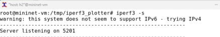
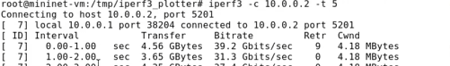
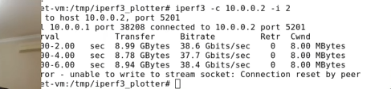

---
## Front matter
lang: ru-RU
title: Презентация по лабораторной работе №2
subtitle: "Моделирование сетей передачи данных"
author:
  - Еюбоглу Тимур
institute:
  - Российский университет дружбы народов, Москва, Россия

## i18n babel
babel-lang: russian
babel-otherlangs: english

## Formatting pdf
toc: false
toc-title: Содержание
slide_level: 2
aspectratio: 169
section-titles: true
theme: metropolis
header-includes:
 - \metroset{progressbar=frametitle,sectionpage=progressbar,numbering=fraction}
---

## Докладчик

:::::::::::::: {.columns align=center}
::: {.column width="70%"}

  * Еюбоглу Тимур
  * Студент группы НПИбд-01-22
  * Студ. билет 1032224357
  * Российский университет дружбы народов имени Патриса Лумумбы

:::
::: {.column width="30%"}

:::
::::::::::::::

## Цель лабораторной работы

- Познакомиться с инструментом для измерения пропускной способности 
сети в режиме реального времени — iPerf3, а также получить навыки проведения интерактивного 
эксперимента по измерению пропускной способности моделируемой сети в среде Mininet.

# Выполнение лабораторной работы

## Установка необходимого программного обеспечения

{ #fig:001 width=80% height=80% }

##  Установка необходимого программного обеспечения

{ #fig:002 width=80% height=80% }

##  Установка необходимого программного обеспечения

{ #fig:003 width=80% height=80% }

##  Установка необходимого программного обеспечения

{ #fig:004 width=80% height=80% }

## Интерактивные эксперименты

{ #fig:005 width=80% height=80% }

## Интерактивные эксперименты

{ #fig:006 width=80% height=80% }

## Интерактивные эксперименты

{ #fig:007 width=80% height=80% }

## Интерактивные эксперименты

{ #fig:008 width=80% height=80% }

## Интерактивные эксперименты

{ #fig:009 width=80% height=80% }

## Интерактивные эксперименты

{ #fig:010 width=80% height=80% }

## Интерактивные эксперименты

{ #fig:011 width=80% height=80% }

## Интерактивные эксперименты

{ #fig:012 width=80% height=80% }

## Интерактивные эксперименты

{ #fig:013 width=80% height=80% }

## Интерактивные эксперименты

{ #fig:014 width=80% height=80% }

## Интерактивные эксперименты

{ #fig:015 width=80% height=80% }

## Интерактивные эксперименты

{ #fig:016 width=80% height=80% }

## Интерактивные эксперименты

{ #fig:017 width=80% height=80% }

## Интерактивные эксперименты

{ #fig:018 width=80% height=80% }

## Интерактивные эксперименты

{ #fig:019 width=80% height=80% }

## Интерактивные эксперименты

{ #fig:020 width=80% height=80% }

## Интерактивные эксперименты

{ #fig:021 width=80% height=80% }

## Интерактивные эксперименты

{ #fig:022 width=80% height=80% }

## Интерактивные эксперименты

{ #fig:023 width=80% height=80% }

## Интерактивные эксперименты

{ #fig:024}

## Интерактивные эксперименты

{ #fig:025}

## Интерактивные эксперименты

{ #fig:026 width=80% height=80% }

## Интерактивные эксперименты

{ #fig:027}

## Интерактивные эксперименты

{ #fig:028}

## Интерактивные эксперименты

{ #fig:029 width=80% height=80% }

## Интерактивные эксперименты

{ #fig:030 width=80% height=80% }

## Интерактивные эксперименты

{ #fig:031 width=80% height=80% }

# Вывод

## Вывод

- В ходе выполнения лабораторной работы познакомились с инструментом для измерения пропускной 
способности сети в режиме реального времени — iPerf3, а также получили навыки проведения 
интерактивного эксперимента по измерению пропускной способности моделируемой сети в среде Mininet.

# Список литературы. Библиография

[[1] Mininet: https://mininet.org/