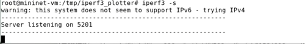

---
## Front matter
title: "Лабораторная работа №2"
subtitle: "Моделирование сетей передачи данных"
author: "Еюбоглу Тимур"

## Generic otions
lang: ru-RU
toc-title: "Содержание"

## Bibliography
bibliography: bib/cite.bib
csl: pandoc/csl/gost-r-7-0-5-2008-numeric.csl

## Pdf output format
toc: true # Table of contents
toc-depth: 2
lof: true # List of figures
lot: true # List of tables
fontsize: 12pt
linestretch: 1.5
papersize: a4
documentclass: scrreprt
## I18n polyglossia
polyglossia-lang:
  name: russian
  options:
  - spelling=modern
  - babelshorthands=true
polyglossia-otherlangs:
  name: english
## I18n babel
babel-lang: russian
babel-otherlangs: english
## Fonts
mainfont: IBM Plex Serif
romanfont: IBM Plex Serif
sansfont: IBM Plex Sans
monofont: IBM Plex Mono
mathfont: STIX Two Math
mainfontoptions: Ligatures=Common,Ligatures=TeX,Scale=0.94
romanfontoptions: Ligatures=Common,Ligatures=TeX,Scale=0.94
sansfontoptions: Ligatures=Common,Ligatures=TeX,Scale=MatchLowercase,Scale=0.94
monofontoptions: Scale=MatchLowercase,Scale=0.94,FakeStretch=0.9
mathfontoptions:
## Biblatex
biblatex: true
biblio-style: "gost-numeric"
biblatexoptions:
  - parentracker=true
  - backend=biber
  - hyperref=auto
  - language=auto
  - autolang=other*
  - citestyle=gost-numeric
## Pandoc-crossref LaTeX customization
figureTitle: "Рис."
tableTitle: "Таблица"
listingTitle: "Листинг"
lofTitle: "Список иллюстраций"
lotTitle: "Список таблиц"
lolTitle: "Листинги"
## Misc options
indent: true
header-includes:
  - \usepackage{indentfirst}
  - \usepackage{float} # keep figures where there are in the text
  - \floatplacement{figure}{H} # keep figures where there are in the text
---

## Цель лабораторной работы

Основной целью работы является знакомство с инструментом для измерения пропускной способности 
сети в режиме реального времени — iPerf3, а также получение навыков проведения интерактивного 
эксперимента по измерению пропускной способности моделируемой сети в среде Mininet.

# Выполнение лабораторной работы

## Установка необходимого программного обеспечения 

После запуска виртуальной машины обновим репозитории программного обеспечения. (рис. [-@fig:001]):

{#fig:001}

Затем установим iperf3. (рис. [-@fig:002]):

{#fig:002}

Установим необходимое дополнительное программное обеспечение на виртуальную машину. (рис. [-@fig:003]):

{#fig:003}

Развернём iperf3_plotter. Для этого перейдём во временный каталог и скачаем репозиторий, далее установим iperf3_plotter. (рис. [-@fig:004]):

{#fig:004}

## Интерактивные эксперименты

В самом начале исправим права запуска X-соединения (рис. [-@fig:005]):

{#fig:005}

Зададим простейшую топологию, состоящую из двух хостов и коммутатора с назначенной по 
умолчанию mininet сетью 10.0.0.0/8. После команды запустились терминалы двух хостов, коммутатора и контроллера. 
Терминалы коммутатора и контроллера закроем (рис. [-@fig:006]):

{#fig:006}

В терминале виртуальной машины просмотрим параметры запущенной в интерактивном режиме топологи (рис. [-@fig:007]):

{#fig:007}

В терминале h2 запустим сервер iPerf3. После запуска этой команды хост h2 перешёл в состояние прослушивания 
5201-го порта в ожидании входящих подключений (рис. [-@fig:008]):

{#fig:008}

В терминале хоста h1 запустим клиент iPerf3. Здесь параметр -c указывает, что хост 
h1 настроен как клиент, а параметр 10.0.0.2 является IP-адресом сервера iPerf3 (хост h2) (рис. [-@fig:009]):

{#fig:009}

Остановим сервер iPerf3 в терминале хоста h2 (рис. [-@fig:010]):

{#fig:010}

Запустим сервер iPerf3 на хосте h2. запустим клиент iPerf3 на хосте h1 и потом остановим 
серверный процесс (рис. [-@fig:011]):

{#fig:011}

В терминале h2 запустим сервер iPerf3 (рис. [-@fig:012]):

{#fig:012}

В терминале h1 запустим клиент iPerf3 с параметром -t, за которым следует количество секунд (рис. [-@fig:013]):

{#fig:013}

Настроим клиент iPerf3 для выполнения теста пропускной способности с 2-секундным интервалом 
времени отсчёта как на клиенте, так и на сервере. Используем опцию -i для установки интервала 
между отсчётами, измеряемого в секундах (рис. [-@fig:014]) (рис. [-@fig:015]):

{#fig:014}

{#fig:015}

Зададим на клиенте iPerf3 отправку определённого объёма данных. Используем опцию -n для установки количества байт для передачи (рис. [-@fig:016]) (рис. [-@fig:017]):

{#fig:016}

{#fig:017}

Изменим в тесте измерения пропускной способности iPerf3 протокол передачи данных с TCP 
(установлен по умолчанию) на UDP. iPerf3 автоматически определяет протокол транспортного уровня 
на стороне сервера. Для изменения протокола используем опцию -u на стороне клиента iPerf3 (рис. [-@fig:018]) (рис. [-@fig:019]):

{ #fig:018}

{#fig:019}

После завершения теста отобразились следующие сводные данные:
- ID, интервал, передача, битрейт: то же, что и у TCP.
- Jitter: разница в задержке пакетов.
- Lost/Total: указывает количество потерянных дейтаграмм по сравнению с общим количеством отправленных на сервер (и процентное соотношение).

В тесте измерения пропускной способности iPerf3 изменим номер порта для отправки/получения 
пакетов или датаграмм через указанный порт. Используем для этого опцию -p (рис. [-@fig:020]) (рис. [-@fig:021]):

{#fig:020}

{#fig:021}

По умолчанию после запуска сервер iPerf3 постоянно прослушивает входящие соединения. 
В тесте измерения пропускной способности iPerf3 зададим для сервера параметр обработки данных 
только от одного клиента с остановкой сервера по завершении теста. Для этого используем опцию -1 
на сервере iPerf3 (рис. [-@fig:022]) (рис. [-@fig:023]):

{#fig:022}

{#fig:023}

В виртуальной машине mininet создадим каталог для работы над проектом (рис. [-@fig:024]):

{#fig:024}

В терминале h2 запустим сервер iPerf3 (рис. [-@fig:025]):

{#fig:025}

В терминале h1 запустим клиент iPerf3, указав параметр -J для отображения вывода результатов в формате JSON (рис. [-@fig:026]):

{#fig:026}

Экспортируем вывод результатов теста в файл, перенаправив стандартный вывод в файл (рис. [-@fig:027]):

{#fig:027}

Убедимся, что файл iperf_results.json создан в указанном каталоге (рис. [-@fig:028]):

{#fig:028}

Завершм работу mininet в интерактивном режиме (рис. [-@fig:029]):

{#fig:029}

В виртуальной машине mininet перейдём в каталог для работы над проектом и скорректируем права 
доступа к файлу JSON (рис. [-@fig:030]):

{#fig:030}

Сгенерируем выходные данные для файла JSON iPerf3 и убедимся, что файлы с данными и графиками 
сформировались(рис. [-@fig:031]):

{#fig:031}

# Вывод

## Вывод

В ходе выполнения лабораторной работы познакомились с инструментом для измерения пропускной 
способности сети в режиме реального времени — iPerf3, а также получили навыки проведения 
интерактивного эксперимента по измерению пропускной способности моделируемой сети в среде Mininet.

# Список литературы. Библиография

[1] Mininet: https://mininet.org/